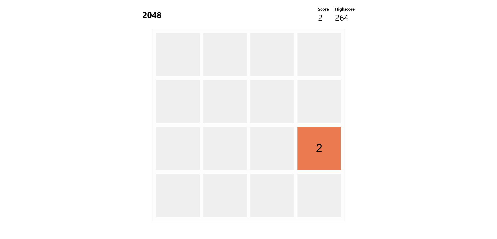

2048 on a JavaScript canvas.

## Why do we need another 2048 clone?

Well, we don't, but a friend of mine wanted to waste some time and found out
that a bunch of the 2048 games online are _very_ poorly performing. So I figured
that I give it a shot, surely it isn't _that hard_ to make 2048 fast, right?

## Why isn't it slow?

Instead of modifying the <abbr title="Document Object Model">DOM</abbr> this
version uses a JavaScript canvas, in other words the game board is just a bitmap
image. This gives a few benefits:

- JavaScript doesn't attempt to manage the state of the canvas, freeing up
  memory.
- Instead of having the redraw the canvas we can continue to draw over the
  existing data, it's just an image after all and the data inside of it doesn't
  have to garbage collected or freed up anyway.

Although, using a canvas isn't always the easiest:

- Because JavaScript doesn't manage the data on the canvas it's up to us to
  manage the data and make sure that the canvas matches the state that
  JavaScript knows.
- If a graphical bug where to occur it would remain present until the region
  where it occured is overwritten.
- We are given no knowledge of the exact state within the canvas, every check to
  see where blocks are and what they are touching must be done in JavaScript
  with the hope that the canvas has the same state that we think it has.

## Why doesn't it look all that pretty?

I've slowly given up on making websites look nice, feel free to fork it and make
your own that looks fancy. I'm also open to pull requests ;) .
